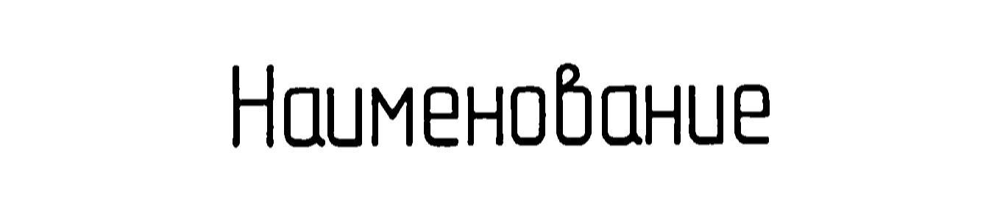
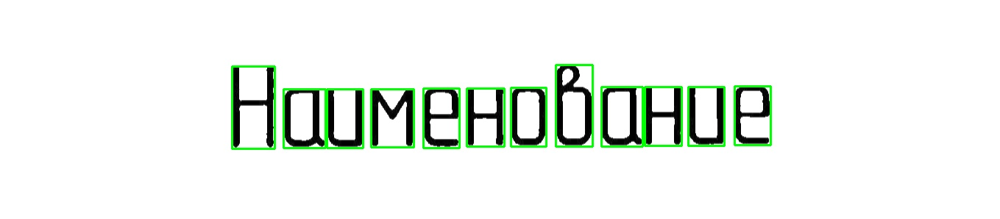

### Поиск символов на изображении и дальнейшее распознавание

---

Входное изображение:

После обнаружения символы обводятся:

Далее блок с изображением символа вырезается и отправляется на распознавание.
Распознавание происходит с помощью выбранной предобученной модели на конкретном наборе символов и шрифте.